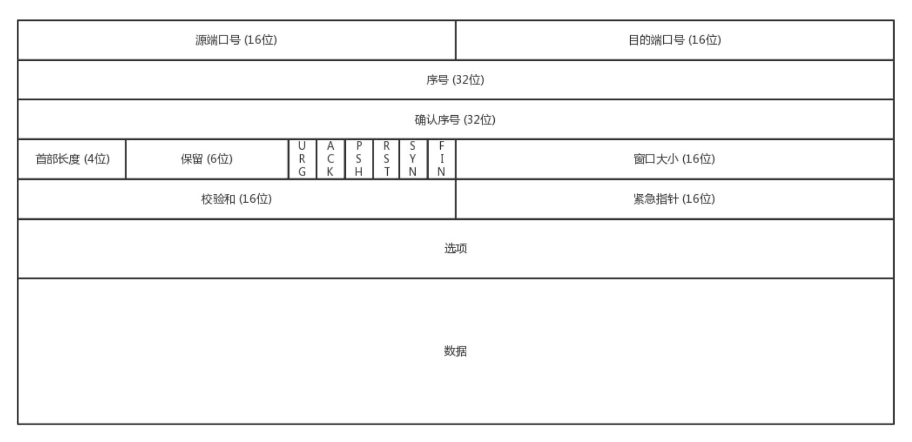
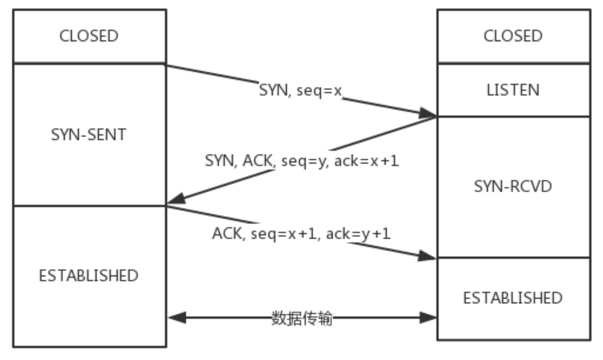
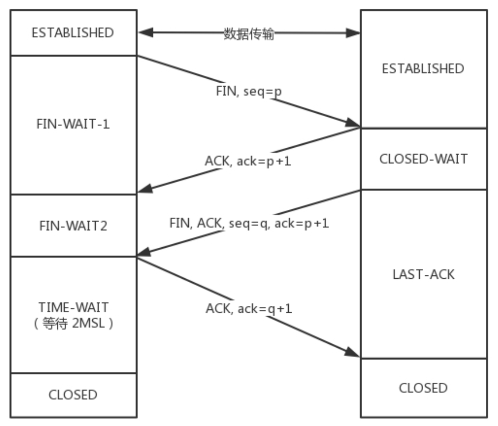
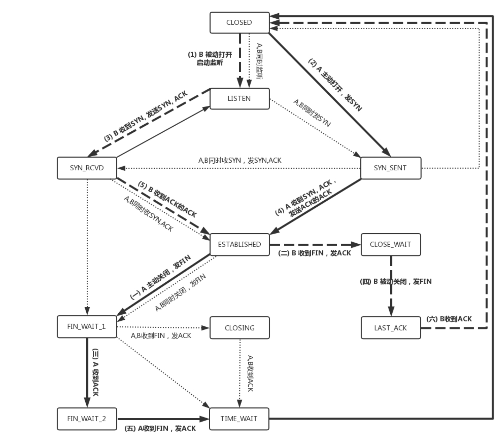

## 传输层协议，tcp与udp的区别
tcp与udp的显著区别是tcp是面向连接的，udp是面向无连接的

何为建立连接？

所谓的建立连接，是为了在客户端和服务端维护连接，而建立一定的数据结构来维护双方交 互的状态，用这样的数据结构来保证所谓的面向连接的特性

* TCP 提供可靠交付。通过 TCP 连接传输的数据，无差错、不丢失、不重复、并且按序到达。我们都知道 IP 包是没有任何可靠性保证的，但是 TCP 可以做到那个连接维护的程序做的事情，而 UDP 继承了 IP 包的特性，不保证不丢失，不保证按顺序到达。
* TCP 是面向字节流的。发送的时候发的是一个流，没头没尾。IP 包可不是一个流，而是一个个的 IP 包。之所以变成了流，这也是 TCP 自己的状态维护做的事情。而 UDP 继承了 IP 的特性，基于数据报的，一个一个地发，一个一个地收。
* TCP 是可以有拥塞控制的。如果发现丢包或者网络情况不佳，会根据情况调整自己的行为，看看是不是发快了，要不要发慢点。UDP 就不会，应用让它发就会发。

TCP 其实是一个有状态服务，通俗地讲就是有脑子的，里面精确地记着发送了没有， 接收到没有，发送到哪个了，应该接收哪个了，错一点儿都不行。而UDP 则是无状态服务。 通俗地说是没脑子的，天真无邪的，发出去就发出去了。

## UDP
### 包头
一个UDP包到达目标机器后，发现 MAC 地址匹配，于是就取下来，将剩下的包传给处理 IP 层的代码。把 IP 头取下来， 发现目标 IP 匹配， 在 IP 头 里面有个 8 位协议，这里会存放，数据里面到底是 TCP 还是 UDP。 接下来的逻辑就可以交给应用了，通过UDP包头的端口号，来识别到底交给哪一个应用程序来处理。UDP包头只包含源端口号、目标端口号、UDP长度、UDP校验和四个部分，都是16位，剩下的就是数据了，包头非常精简(比起TCP)
### 三大特点
* 简单：数据结构、处理逻辑、包头字段简单
* 不建立连接：虽然有端口号，不限制数据的接收方和发送发，甚至可以发广播(多个数据接收方)
* 不会主动调整：无论网络情况如何、是否阻塞、是否丢包，它都照常发
### 主要使用场景
* 需要资源少，在网络情况比较好的内网，或者对于丢包不敏感的应用。
* 不需要一对一沟通，建立连接，而是可以广播的应用
* 需要处理速度快，时延低，可以容忍少数丢包，但是要求即便网络拥塞，还是要照常发送
### 应用举例
#### QUIC
QUIC(全称Quick UDP Internet Connections，快速 UDP 互联网连接)，是谷歌提出的一种基于 UDP 改进的通信协议。 原来访问网页和手机APP主要使用的是基于 TCP 协议的 HTTP 协议，建立连接需要多次交互。 对于移动互联网来说，由于时延较大等原因，建立一次连接需要的时间比较长，而且TCP还可能经常断线重连。 HTTP 协议往往采用多个数据通道共享一个连接的情况，目的是为了加快传输速度，但 TCP 的严格顺序策略会导致阻塞，前一个不来，后一个即便和前一个没关系，也需要等待，加大了时延。 QUIC的目标就是降低网络通信的延迟，它在应用层上实现快速链接建立、减少重传时延，自适应拥塞控制。
#### 流媒体协议
直播协议多使用RTMP，也是一个基于 TCP 的协议。TCP 的严格顺序传输要保证前一个收到了，下一个才能确认，如果前一个收不到，下一个就算包已经收到了，在缓存里面，也需要等着。 这种体验对于直播来说显然是不合适的，对于直播来说，宁可丢包也不要卡顿，用户可以容忍老的视频帧丢失，但不能容忍新的视频帧一直不来。 此外，对于视频来说，连续帧里面有的帧是重要的，有的是不重要的，如果必须丢包，能做到隔几个帧丢一个，用户是感知不到丢包的。 当网络不好的时候，TCP 协议会主动降低发送速度，对于本来就卡的视频是要命的，应用层更希望马上能重传视频而不是主动让步。 基于上述几点，很多直播应用都基于 UDP 实现了自己的视频传输协议。
#### 实时游戏
实时游戏的特点就是实时性高，实时游戏中客户端和服务端会建立长连接来保证实时传输。 由于维护 TCP 连接需要在内核维护一些数据结构，一台机器能够支撑的 TCP 连接数
是有限的，所以 UDP 通常是应对海量客户端连接的策略。 此外，和直播类似的问题，由于 TCP 的强顺序问题，如果出现一个数据包丢失，所有的事情都要停下来等这个数据包重发，然而游戏玩家不关注过期的数据，fps游戏中卡一秒就可能被对手干掉了。 所以，在实时要求比较严格的情况下，游戏厂商也会采取自定义的 UDP 协议，自定义重传策略，把丢包产生的延迟降到最低，尽量减少网络问题对游戏性的影响。
#### 物联网
物联网的终端可能只是个内存很小的嵌入式系统，维护 TCP 协议代价太大，而且物联网对实时性要求也很高，上述原因导致的延时问题在这里也会出现。 Google 旗下的 Nest 建立了 Thread Group，推出了物联网通信协议 Thread ，此协议就是基于 UDP 协议的。
#### 移动互联网
4G 网络的 GTP-U 协议就是基于 UDP 的，因为移动网络协议比较复杂，而 GTP 协议本身就包含复杂的手机上线下线的通信协议。如果基于 TCP， TCP 的机制就显得非常多余。

## TCP
### 包头

* 源端口和目标端口号：与 UDP 一样，必不可少，如果没有这两个端口，数据就不知道要发给哪个应用
* 序号：解决乱序问题
* 确认序号：确认发出去的包已经收到，没有收到会重新发送
* 状态位：例如 SYN 是发起一个连接，ACK 是回复，RST 是重新连接，FIN 是结束连接等。TCP 是面向连接的，因而双方要维护连接的状态，这些带状态位的包的发送，会引起双方的状态变更
* 窗口大小：用来做流量控制，通信双方各声明一个窗口，标识自己当前的处理能力。 除流量控制外， TCP 还会做拥塞控制，在网络环境不佳时降低发送速度。

### 三次握手
即 请求 -> 应答 -> 应答之应答，假设有 A B 两端， A 主动建立连接，A 首先会向 B 发送一个包，在确认 B 收到这个包之前， A 会持续的重发， 当 B 收到后，如果确认可以建立连接，则会发一个应答包给 A (同样在收到应答前会持续重发)， 当 A 收到后，会认为连接已经建立了，并给 B 发送 "应答之应答" 包，B 收到这个消息后才确认连接建立。
* 为什么不是两次？

    两次不足以建立连接，假设 A B 短暂建立了连接又关闭，A 此前为建立连接可能已经发了好几个包，假设其中一个因为各种原因在连接关闭后到达 B ，B 又会建立一个新连接
* 为什么不是四次？

    如果还需确认 "应答之应答"，那么这个过程会无休止的持续下去，四十次、四百次都不够，三次可以保证双方的消息都有去有回就足够了。
    
三次握手除了建立连接外，还沟通了序号的问题。 A 要告诉 B，自己的序号是从什么开始的， B 同样也要告诉 A 。每次连接都要有不同的序号，这主要是为了防止冲突， 比如 A 发了需要为1 2的两个包，在发3的时候，网络突然出问题了，此时如果 A 掉线然后重新和 B 建立连接，包序号又从1开始，发了 1 2两个包，没有发 3，上次连接发送的3此时到达了 B，B会认为这就是下一个包，从而发生错误。 TCP 的包序号，可以看做一个 32 位的计数器，每 4 ms 加 1，可以保证在四个多小时内不重复，不太可能有包在长达四个多小时的网络漫游后才到达目的地。

一开始，客户端和服务端都处于 CLOSED 状态。先是服务端主动监听某个端口，处于 LISTEN 状态。然后客户端主动发起连接 SYN，之后处于 SYN-SENT 状态。服务端收到发起的连接，返回 SYN，并且 ACK 客户端的 SYN，之后处于 SYN-RCVD 状态。客户端收到服务端发送的 SYN 和 ACK 之后，发送 ACK 的 ACK，之后处于 ESTABLISHED 状态，因为它一发一收成功了。服务端收到 ACK 的 ACK 之后，处于 ESTABLISHED 状态，因为它也一发一收了。

### 四次挥手

断开的时候，我们可以看到，当 A 想断开连接，发送 FIN 包，就进入 FIN_WAIT_1 的状态，B 收 到后，发送 ACK 包，就进入 CLOSE_WAIT 的状态。
A 收到 B 的 ACK 包，就进入 FIN_WAIT_2 的状态，如果这个时候 B 直接断开，则 A 将永远在这个状态。TCP 协议里面并没有对这个状态的处理，但是 Linux有，可以调整 tcp_fin_timeout 这个参数，设置一个超时时间。

如果 B 没有直接断开，发送 FIN ACK 请求到 A ，A 回复 ACK 到 B，从 FIN_WAIT_2状态结束，如果这时候 A 直接断开，假如最后的这个 ACK 没有收到，B 会重新发一个给 A，但是再也收不到 A 回复的 ACK了。 所以，TCP 协议要求 A 最后等待一段时间 TIME_WAIT，这个时间要足够长，足够 B 在没有收到 ACK 的情况下再重发到 A， A 再回复 ACK 到达B。 A 直接断开还有一个问题是 A 的端口此时空出来了，但是 B 还不知道， B 之前可能有发送的包还在路上， 此时 A 释放出来的端口可能被新的应用收到，虽然有序号保证但是还是由可能产生混乱(可能过了四个小时，序号已经开始重复了，需要双保险)。 A 等待的时间 TIME-WAIT 通常是 2MSL，MSL是Maximum Segment Lifetime，报文最大生存时间，它是任何报文在网络上存在的最长时间，超过这个时间报文将被丢弃。

 直接跑路还有一个问题是，A 的端口就直接空出来了，但是 B 不知道，B 原来发过的很 多包很可能还在路上，如果 A 的端口被一个新的应用占用了，这个新的应用会收到上个连 接中 B 发过来的包，虽然序列号是重新生成的，但是这里要上一个双保险，防止产生混 乱，因而也需要等足够长的时间，等到原来 B 发送的所有的包都死翘翘，再空出端口来。因为 TCP 报文基于是 IP 协议的，而 IP 头中有一个 TTL 域，是 IP 数据报可以经过的最大路由数，每经过一个处 理他的路由器此值就减 1，当此值为 0 则数据报将被丢弃，同时发送 ICMP 报文通知源主机。协议规定 MSL 为 2 分钟，实际应用中常用的是 30 秒，1 分钟和 2 分钟等。
                                                                                                                                   还有一个异常情况就是，B 超过了 2MSL 的时间，依然没有收到它发的 FIN 的 ACK，怎么 办呢?按照 TCP 的原理，B 当然还会重发 FIN，这个时候 A 再收到这个包之后直接发送 RST，B 就知道 A 早就断开了。

  附：TCP状态机
  

